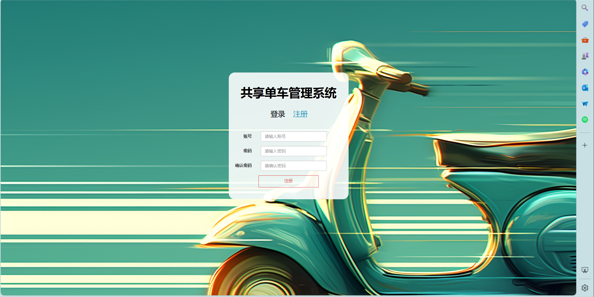
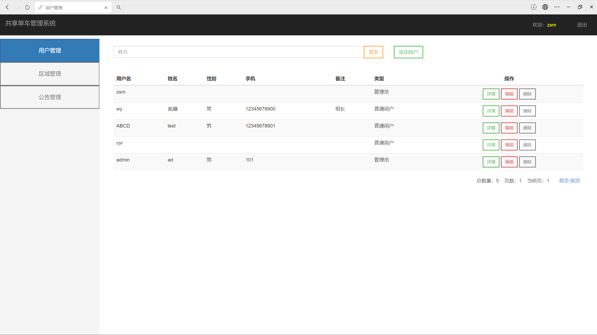
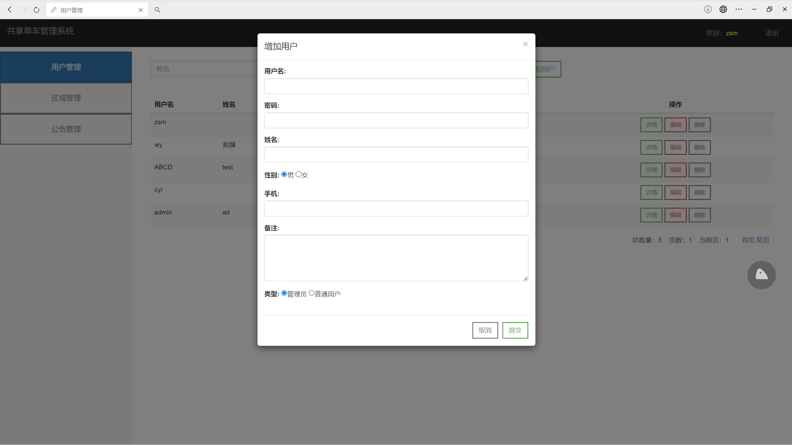
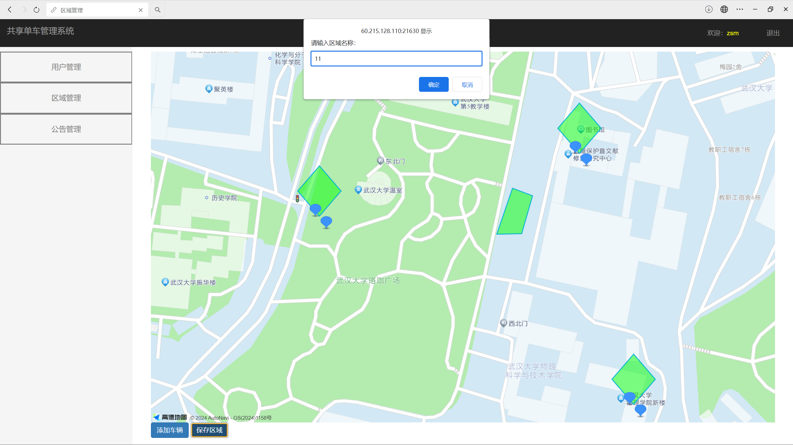
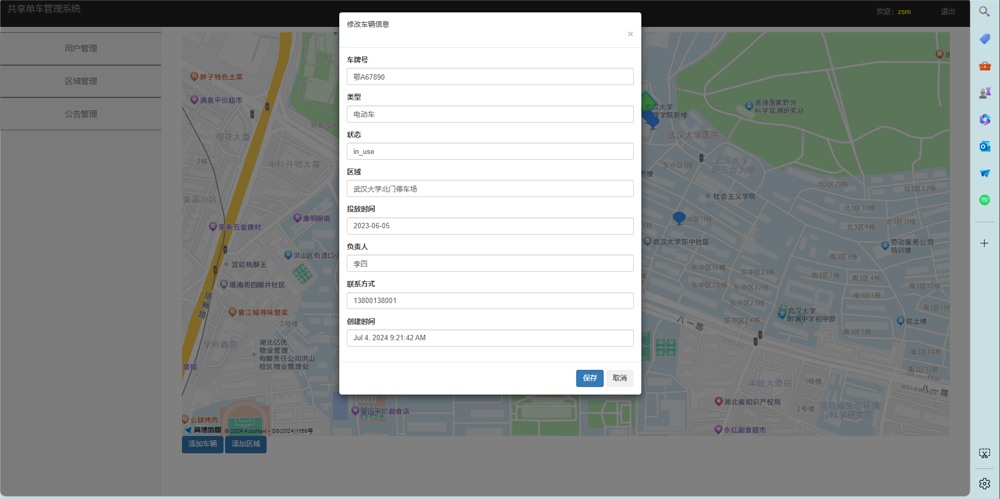
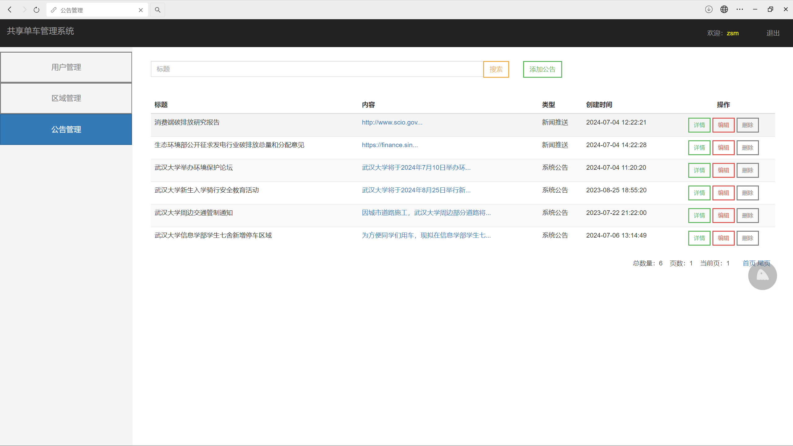
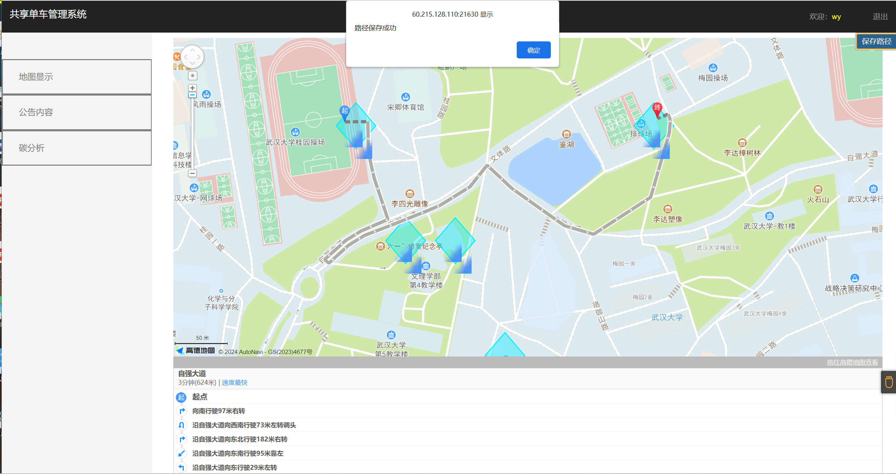
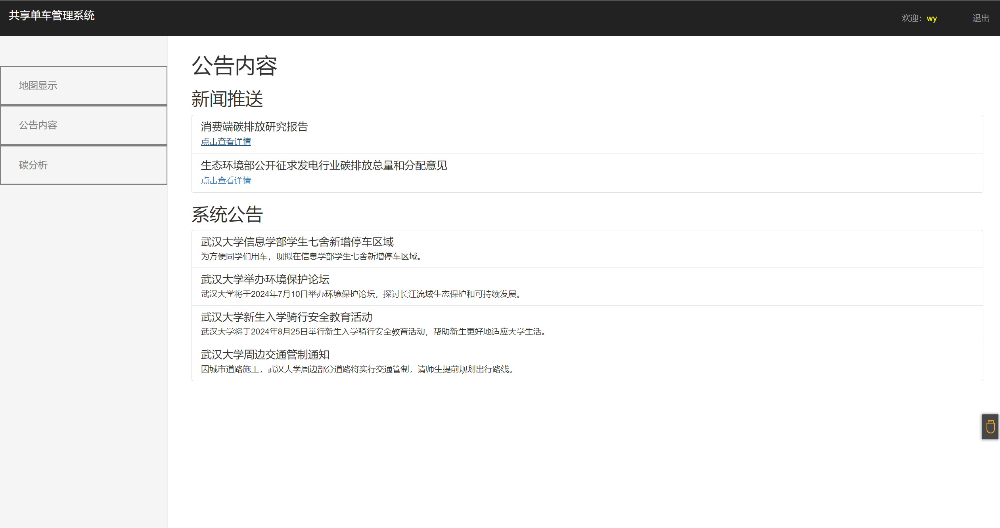
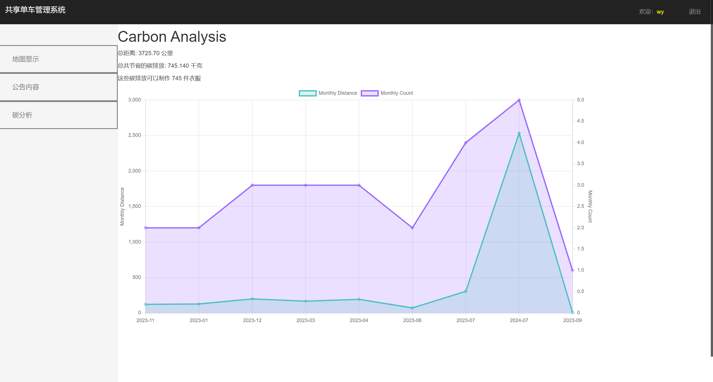
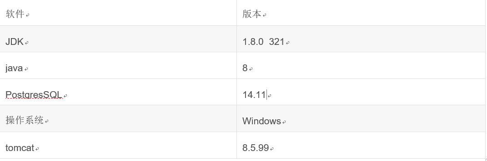

# 页面及功能展示
## （1）登录及注册界面

管理员和普通用户采用同一个登录入口，登录时需要输入随机生成的验证码。注册账号身份默认为普通用户，若需要注册管理员可以由现有管理员添加，或者修改后端数据库。
（管理员账号：zsm 密码：222） 
（普通用户账号：wy 密码：333）

## （2）管理员界面
### ①用户管理

可以查看、添加、修改和删除用户账户。功能包括： 
查看用户列表：显示所有用户的基本信息，包括用户名、密码、姓名、联系方式等。 
添加用户：通过填写表单添加新的用户（包括普通用户和管理员），并设置相关信息。 
修改用户信息：更新用户的个人信息和权限。 
删除用户：从系统中移除不再需要的用户账户。 
同时管理员可以通过用户名称快捷搜索用户。
### ②区域管理

可以在地图上查看停车区域的位置以及具体信息，可以通过点击修改或删除按钮对停车区域进行相应操作。 
可以点击地图下方的增加区域按钮，在地图上选点形成闭合区域并填写相关信息后完成停车区域的添加操作。 
可以在地图上查看车辆的位置以及具体信息，通过点击修改或删除按钮对车辆进行相应操作，可以点击地图下方的增加车辆按钮，在地图上选取车辆位置点并填写相关信息后完成停车区域的添加操作。
### ③公告管理

管理员可以管理公告，向用户发布系统公告或新闻推送。功能包括： 
查看公告列表：显示所有公告的标题、发布时间、类型和内容摘要。 
发布新公告：通过填写表单，在选择类型后创建和发布新公告。 
修改公告：编辑和更新已发布的公告内容。 
删除公告：移除不再需要的公告。 
## （3）普通用户界面
### ①地图显示

页面上会绘制出地图，通过鼠标滚轮进行地图放大、缩小的功能。 
地图上绘制的蓝色三角形为可使用的车辆，蓝色的菱形为停车区域. 
将地图上的可使用车辆设置为起点，选中停车区域为终点，然后页面上会绘制出规划的路径，点击保存路径的按钮会将这条路径保存到数据库中。
### ②公告内容

分为新闻推送和系统公告两部分，都是由管理员写入数据库后，从数据库读出并显示在页面上。 
其中，新闻推送部分的内容是由链接组成的，用户点击链接可以跳转到写有相关文章的网页，而系统公告是展现管理员发布的有关附近区域的活动、维修等内容。
### ③碳分析

用户登录后可以在侧边栏选择碳分析功能，页面上自动获取用户的userid并从数据库中获取对应的路径，进行一系列碳分析, 
诸如：总距离，总共节省的碳排放，这些碳排放可以制作的衣服件数。以及生成对应的月度碳距离和次数折线图，可以自主选择展示哪些图。

# 相关配置
相关配置如图，使用时可以直接将sql文件导入数据库中。

